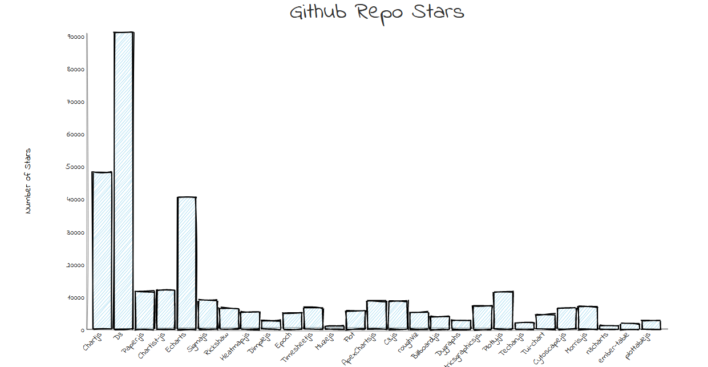

# Data Visualization of Github Repo Stars

This is a data visualization of Data Visualization framework/libary's Github Repo Stars. This visualization is done with the help of [RoughViz](https://github.com/jwilber/roughViz) libary.

